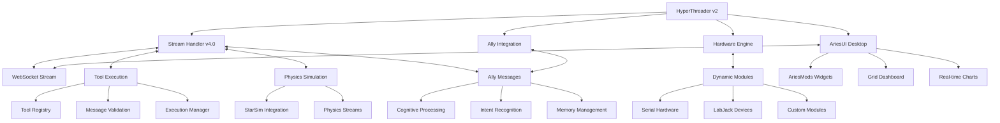
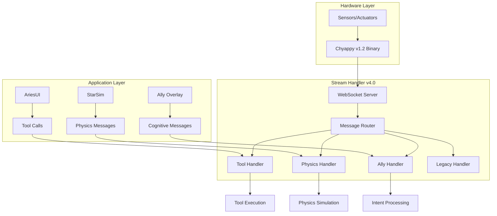
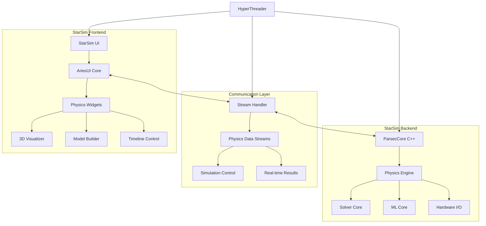

# Comms Alpha v4.0 - Unified Robot Cognitive Overlay Platform

[](https://github.com/AryanRai/Comms)
[](LICENSE)
[](README.md)
[](README.md)
[](README.md)
[](README.md)
[](README.md)


> **A unified robot cognitive overlay platform combining hardware interfacing, AI tool calling, physics simulation, and real-time communication. Built for autonomous robotics, laboratory automation, and intelligent control systems.**

Comms Alpha v4.0 provides a complete ecosystem for robot cognitive overlays with tool calling framework, Ally AI integration, physics simulation support, and the unified Chyappy v4.0 protocol - designed for autonomous robots, intelligent hardware systems, and **real-time cognitive decision making**.

---

## 🚀 Quick Start

### Option 1: HyperThreader (Recommended)
```bash
# Clone the repository
git clone -b Dev3.0V https://github.com/AryanRai/Comms.git
cd Comms

# Install Python dependencies
pip install socketify labjack-ljm numpy pandas pywebview bottle

# Install UI dependencies  
cd ui/ariesUI
npm install
cd ../..

# Start integrated process manager
python HyperThreader.py
```
**HyperThreader provides:**
- One-click start/stop for all components
- Real-time performance monitoring
- Configurable update rates
- Debug windows for all processes
- Process health monitoring

### Option 2: Manual Component Start
```bash
# Terminal 1: Start Stream Handler
cd sh && python sh.py

# Terminal 2: Start Hardware Engine  
cd en && python en.py

# Terminal 3: Start AriesUI Desktop App
cd ui/ariesUI && npm run electron-dev

# OR Start AriesUI Web Version
cd ui/ariesUI && npm run dev
```

---

## ✨ What's New in v4.0

### 🤖 Unified Robot Cognitive Overlay
- **Tool Calling Framework**: Complete tool execution system with validation and routing
- **Ally AI Integration**: Seamless connection to Ally desktop overlay for cognitive processing
- **Chyappy v4.0 Protocol**: Unified protocol supporting tool calls, physics simulation, and hardware
- **Stream Handler v4.0**: Merged tool calling, physics simulation, and Ally message routing
- **Cognitive Decision Making**: Real-time AI-driven hardware control and automation

### 🛠️ Advanced Tool Calling System
- **JSON Schema Validation**: Complete message validation for tool_call and tool_result types
- **Execution Management**: Async tool execution with timeout, retry, and error handling
- **Message Registry**: Dynamic message type registration and handler management
- **Protocol Extensions**: Extensible message types for custom tool implementations
- **Integration Testing**: Comprehensive test suite for tool execution workflows

### 🔬 Enhanced Physics Integration
- **StarSim v4.0 Support**: Real-time physics simulation data streaming
- **Physics Control Panel**: Start, pause, stop simulations from AriesUI
- **Vector Field Visualization**: 2D/3D physics data rendering
- **Simulation Management**: Multi-simulation support with stream registration
- **Real-time Updates**: Sub-millisecond physics data streaming

### 🧠 Ally Cognitive Integration
- **Message Routing**: Direct integration with Ally desktop overlay
- **Intent Processing**: AI intent recognition and tool execution
- **Memory Management**: Persistent conversation and decision history
- **Speech Integration**: Voice commands for robot control
- **Multi-modal Processing**: Vision, speech, and sensor data fusion

### 🎯 Complete UI Rebuild - AriesUI (Maintained)
- **Performance Optimized**: Hardware-accelerated 60fps rendering with RequestAnimationFrame
- **Modular Architecture**: Main content reduced from 2,719 lines to ~400 focused lines
- **Virtual Grid System**: Viewport culling for thousands of widgets
- **Smooth Interactions**: Ultra-responsive dragging, zooming, and panning
- **Hardware Integration**: Direct stream binding with configuration UI

---

## 🏗️ System Architecture



### Core Components

#### 🐍 Backend (Python)
- **Engine (en/)**: Hardware interfacing with dynamic module loading
- **Stream Handler v4.0 (sh/)**: Unified WebSocket server with tool calling, physics, and Ally support
- **Tool Message Handlers**: Complete tool execution framework with validation
- **Message Registry**: Dynamic message type registration and routing
- **Dynamic Modules**: Hardware wrappers for sensors, actuators, and devices
- **HyperThreader v2**: Advanced process management and performance monitoring

#### ⚛️ Frontend (React/Next.js)
- **AriesUI**: Performance-optimized dashboard with drag-and-drop widgets
- **AriesMods**: Extensible plugin system for custom widgets
- **Stream Integration**: Real-time hardware data binding
- **Tool Integration**: Direct tool calling from UI components
- **Electron Support**: Cross-platform desktop application

#### 🤖 Cognitive Integration
- **Ally Integration**: Direct connection to Ally desktop overlay
- **Tool Calling Framework**: Complete tool execution system
- **Intent Processing**: AI-driven decision making and tool selection
- **Memory Management**: Persistent conversation and decision history

#### 🔌 Communication - Chyappy v4.0 Protocol
- **Unified Protocol**: Combines WebSocket JSON with binary Chyappy compatibility
- **Tool Messages**: `tool_call` and `tool_result` message types with full validation
- **Physics Messages**: Real-time physics simulation data streaming
- **Ally Messages**: `ally_intent`, `ally_memory`, `ally_query`, `ally_status` types
- **Legacy Support**: Backward compatibility with Chyappy v1.2 binary protocol
- **Error Handling**: Comprehensive error recovery and logging

---

## 🔗 Chyappy v4.0 Unified Protocol

### Protocol Overview

The Chyappy v4.0 Unified Protocol integrates the original Chyappy binary protocol with WebSocket JSON messaging, tool calling framework, physics simulation support, and Ally cognitive integration for seamless communication across the entire robot cognitive overlay system.

### Protocol Architecture



### Message Types

#### 1. Tool Execution Messages

**Tool Call Message:**
```json
{
  "type": "tool_call",
  "source": "ally_overlay",
  "tool_name": "robot_navigate",
  "parameters": {
    "target_position": [1.0, 2.0, 0.0],
    "speed": 0.5
  },
  "execution_id": "exec_nav_001",
  "context": {
    "user": "operator",
    "priority": "high",
    "timeout": 30.0
  },
  "msg-sent-timestamp": "2025-07-27T19:25:35.123Z"
}
```

**Tool Result Message:**
```json
{
  "type": "tool_result",
  "execution_id": "exec_nav_001",
  "tool_name": "robot_navigate",
  "status": "success",
  "result": {
    "final_position": [1.02, 1.98, 0.0],
    "time_taken": 12.5,
    "path_length": 3.2
  },
  "execution_info": {
    "start_time": "2025-07-27T19:25:35.123Z",
    "end_time": "2025-07-27T19:25:47.623Z",
    "duration_ms": 12500
  },
  "msg-sent-timestamp": "2025-07-27T19:25:47.623Z"
}
```

#### 2. Ally Cognitive Messages

**Intent Recognition:**
```json
{
  "type": "ally_intent",
  "source": "ally_overlay",
  "intent": "navigate_to_location",
  "confidence": 0.95,
  "slots": {
    "location": "kitchen",
    "urgency": "normal"
  },
  "context": {
    "conversation_id": "conv_123",
    "user_input": "Please go to the kitchen"
  },
  "msg-sent-timestamp": "2025-07-27T19:25:35.123Z"
}
```

**Memory Operations:**
```json
{
  "type": "ally_memory",
  "source": "ally_overlay",
  "action": "store",
  "memory_type": "episodic",
  "content": {
    "event": "navigation_completed",
    "location": "kitchen",
    "timestamp": "2025-07-27T19:25:47.623Z",
    "success": true
  },
  "msg-sent-timestamp": "2025-07-27T19:25:47.623Z"
}
```

#### 3. Physics Simulation Messages

**Simulation Registration:**
```json
{
  "type": "physics_simulation",
  "action": "register",
  "simulation_id": "robot_dynamics",
  "config": {
    "name": "Robot Dynamics Simulation",
    "solver": "RK4",
    "dt": 0.001,
    "real_time": true
  },
  "msg-sent-timestamp": "2025-07-27T19:25:35.123Z"
}
```

**Real-time Physics Data:**
```json
{
  "type": "physics_simulation",
  "action": "update",
  "simulation_id": "robot_dynamics",
  "stream_id": "joint_positions",
  "data": {
    "value": [0.1, 0.5, -0.2, 1.1, 0.0, 0.3],
    "timestamp": "2025-07-27T19:25:35.123Z",
    "metadata": {
      "joint_names": ["base", "shoulder", "elbow", "wrist1", "wrist2", "wrist3"],
      "units": "radians"
    }
  },
  "msg-sent-timestamp": "2025-07-27T19:25:35.123Z"
}
```

#### 4. Legacy Hardware Messages (Chyappy v1.2 Compatible)

**Sensor Data Stream:**
```json
{
  "type": "negotiation",
  "status": "active",
  "data": {
    "sensor_T_1": {
      "stream_id": "sensor_T_1",
      "name": "Chamber Temperature",
      "datatype": "float",
      "unit": "°C",
      "value": 23.5,
      "status": "active",
      "timestamp": "2025-07-27T19:25:35.123Z",
      "sensor_type": "T",
      "sensor_id": 1,
      "sequence_number": 42,
      "payload_type": 2
    }
  },
  "msg-sent-timestamp": "2025-07-27 19:25:35"
}
```

### Protocol Features

#### Message Validation
- **JSON Schema Validation**: All messages validated against comprehensive schemas
- **Type Safety**: Strict typing for all message fields and payloads
- **Error Handling**: Detailed error messages with recovery suggestions
- **Backward Compatibility**: Support for legacy Chyappy v1.2 binary format

#### Tool Execution Framework
- **Async Execution**: Non-blocking tool execution with timeout support
- **Retry Logic**: Configurable retry attempts with exponential backoff
- **Context Preservation**: Maintain execution context across tool calls
- **Security Validation**: Permission-based tool access control

#### Real-time Performance
- **Sub-millisecond Latency**: Optimized message routing and processing
- **Concurrent Execution**: Multiple tool executions in parallel
- **Stream Multiplexing**: Efficient handling of multiple data streams
- **Memory Management**: Automatic cleanup of completed executions

### Integration Examples

#### AriesUI Tool Integration
```typescript
import { useToolExecution } from '@/hooks/useToolExecution'

const NavigationWidget = () => {
  const { executeToolCall, isExecuting, result } = useToolExecution()
  
  const handleNavigate = async (position: [number, number, number]) => {
    const result = await executeToolCall('robot_navigate', {
      target_position: position,
      speed: 0.5
    })
    
    if (result.status === 'success') {
      console.log('Navigation completed:', result.result)
    }
  }
  
  return (
    <div>
      <button onClick={() => handleNavigate([1, 2, 0])}>
        Navigate to Kitchen
      </button>
      {isExecuting && <div>Navigating...</div>}
    </div>
  )
}
```

#### Ally Integration
```python
from ally_integration import AllyClient

ally = AllyClient()

# Send intent to robot
await ally.send_intent(
    intent="navigate_to_location",
    slots={"location": "kitchen"},
    confidence=0.95
)

# Store memory of completed action
await ally.store_memory(
    memory_type="episodic",
    content={
        "event": "navigation_completed",
        "success": True,
        "location": "kitchen"
    }
)
```

#### Physics Simulation Integration
```cpp
#include "parsec/InputManager.h"

// Register with Stream Handler
parsec::InputManager input_manager("robot_dynamics");
input_manager.initialize("ws://localhost:3000");

// Register physics streams
input_manager.registerStream("joint_positions", "Joint Positions", "vector", "rad");
input_manager.registerStream("joint_velocities", "Joint Velocities", "vector", "rad/s");

// Send real-time updates
std::vector<double> positions = {0.1, 0.5, -0.2, 1.1, 0.0, 0.3};
input_manager.updateStreamValue("joint_positions", positions);
```

---

## 📊 Features & Capabilities

### Robot Cognitive Overlay
- **✅ Tool Calling Framework**: Complete tool execution system with validation
- **✅ Ally AI Integration**: Direct connection to Ally desktop overlay
- **✅ Intent Recognition**: AI-driven decision making and tool selection
- **✅ Memory Management**: Persistent conversation and decision history
- **✅ Multi-modal Processing**: Vision, speech, and sensor data fusion
- **✅ Cognitive Workflows**: Automated decision trees and task execution

### Hardware Support
- **✅ Serial Communication**: RS232, RS485, USB-Serial adapters
- **✅ LabJack Devices**: T4, T7, T8 with analog/digital I/O
- **✅ Custom Modules**: Python-based hardware wrappers
- **✅ Real-time Streaming**: Configurable update rates (10ms-10s)
- **✅ Two-way Control**: Send commands to hardware devices
- **✅ Chyappy v1.2 Compatibility**: Legacy binary protocol support

### Tool Execution System
- **✅ Async Tool Execution**: Non-blocking tool calls with timeout support
- **✅ Message Validation**: JSON schema validation for all tool messages
- **✅ Retry Logic**: Configurable retry attempts with exponential backoff
- **✅ Security Validation**: Permission-based tool access control
- **✅ Execution Tracking**: Real-time monitoring of tool execution status
- **✅ Error Recovery**: Comprehensive error handling and recovery

### Physics Simulation
- **✅ StarSim Integration**: Real-time physics simulation data streaming
- **✅ Multi-simulation Support**: Handle multiple physics simulations
- **✅ Vector Field Visualization**: 2D/3D physics data rendering
- **✅ Simulation Control**: Start, pause, stop simulations from UI
- **✅ Real-time Updates**: Sub-millisecond physics data streaming
- **✅ C++ Integration**: Direct ParsecCore WebSocket communication

### Dashboard Features
- **✅ Drag & Drop**: Smooth widget positioning with collision detection
- **✅ Nested Containers**: Organize widgets in resizable containers
- **✅ Real-time Charts**: Line charts, gauges, and custom visualizations
- **✅ Hardware Controls**: Toggles, sliders, buttons with live feedback
- **✅ Tool Integration**: Direct tool calling from UI components
- **✅ Dark/Light Themes**: Professional theming with custom colors

### Development Tools
- **✅ Widget Templates**: Ready-to-use AriesMod development templates
- **✅ Stream Configurator**: Visual interface for hardware setup
- **✅ Debug Panel**: Real-time performance and connection monitoring
- **✅ Tool Testing**: Built-in tool execution testing and validation
- **✅ Hot Reload**: Instant feedback during widget development
- **✅ TypeScript Support**: Full type safety and IntelliSense

### Production Ready
- **✅ Desktop Application**: Electron-based cross-platform app
- **✅ Web Deployment**: Next.js with Vercel/static hosting support
- **✅ Auto-save**: Persistent layouts and configurations
- **✅ Error Recovery**: Graceful handling of hardware disconnections
- **✅ Performance Monitoring**: Real-time FPS and memory tracking
- **✅ Cognitive Integration**: Production-ready AI decision making

---

## 🛠️ Development

### Creating Custom Hardware Modules
```python
# en/DynamicModules/my_sensor.py
class MySensorModule:
    def __init__(self):
        self.config = {
            "update_rate": 0.1,  # 100ms updates
            "notify_on_change": True
        }
        self.streams = {
            "1": Stream(
                stream_id=1,
                name="Temperature",
                datatype="float",
                unit="°C",
                status="active"
            )
        }
    
    async def update_streams_forever(self):
        while True:
            # Read from hardware
            temperature = self.read_sensor()
            self.streams["1"].value = temperature
            await asyncio.sleep(self.config["update_rate"])
```

### Creating Custom AriesMods
```typescript
// ui/ariesUI/ariesMods/sensors/CustomSensor.tsx
import React from 'react'
import { Card, CardContent, CardHeader, CardTitle } from '@/components/ui/card'
import type { AriesModProps } from '@/types/ariesmods'

const CustomSensor: React.FC<AriesModProps> = ({
  title,
  data,
  config
}) => {
  const value = data?.value ?? '--'
  const unit = config?.unit ?? '°C'
  
  return (
    <Card className="w-full h-full">
      <CardHeader>
        <CardTitle className="text-sm">{title}</CardTitle>
      </CardHeader>
      <CardContent className="flex items-center justify-center">
        <div className="text-3xl font-bold">
          {value} {unit}
        </div>
      </CardContent>
    </Card>
  )
}

export default CustomSensor
```

### Stream Integration
```typescript
// Connect widget to hardware stream
const { value, status, metadata } = useCommsStream('module1.temperature')

// Configure stream mapping
const streamMapping = {
  streamId: 'module1.temperature',
  multiplier: 1.8,
  offset: 32,        // Celsius to Fahrenheit
  unit: '°F',
  precision: 1
}
```

---

## 📁 Project Structure

```
Comms/
├── 🐍 Backend Components
│   ├── en/                          # Hardware Engine
│   │   ├── en.py                   # Main engine process
│   │   ├── enginev0.5.py          # Latest engine version
│   │   └── DynamicModules/         # Hardware module library
│   │       ├── hw_module_1.py      # Example module
│   │       └── hw_win_serial_universal.py # Serial communication
│   ├── sh/                         # Stream Handler
│   │   ├── sh.py                   # WebSocket server
│   │   ├── stream_handlerv4.0.py   # Unified protocol handler with tool calling
│   │   ├── stream_handlerv3.0_physics.py # Physics simulation handler
│   │   ├── stream_handlerv2.4.py   # Tool calling handler
│   │   └── stream_transformers/    # Data processing
│   ├── tool_message_handlers.py    # Tool execution framework
│   ├── message_validation.py       # Message validation and serialization
│   ├── message_registry.py         # Message type registration system
│   ├── schemas/                    # JSON schemas for message validation
│   │   ├── tool_call.schema.json   # Tool call message schema
│   │   ├── tool_result.schema.json # Tool result message schema
│   │   ├── ally_intent.schema.json # Ally intent message schema
│   │   ├── ally_memory.schema.json # Ally memory message schema
│   │   ├── ally_query.schema.json  # Ally query message schema
│   │   └── ally_status.schema.json # Ally status message schema
│   ├── tests/                      # Comprehensive test suite
│   │   ├── test_message_validation.py # Message validation tests
│   │   ├── test_message_registry.py   # Message registry tests
│   │   └── test_protocol_integration.py # Protocol integration tests
│   └── HyperThreaderv2.py          # Advanced process manager
│
├── ⚛️ Frontend Components
│   └── ui/ariesUI/                 # AriesUI Dashboard
│       ├── app/                    # Next.js App Router
│       ├── components/             # React components
│       │   ├── main-content/       # Modular main content
│       │   ├── grid/              # Grid system
│       │   ├── widgets/           # Widget system
│       │   ├── ui/                # 50+ UI components
│       │   └── modals/            # Configuration dialogs
│       ├── ariesMods/             # Plugin system
│       │   ├── sensors/           # Hardware sensors
│       │   ├── controls/          # Interactive controls
│       │   ├── visualization/     # Charts & graphs
│       │   └── utility/           # Utility widgets
│       ├── hooks/                 # Custom React hooks
│       ├── lib/                   # Utility libraries
│       ├── types/                 # TypeScript definitions
│       └── electron/              # Desktop app support
│
├── 📊 Configuration & Data
│   ├── Public/AriesMods/          # Plugin configurations
│   ├── env/                       # Python virtual environment
│   └── Others/Tests/              # Test suites
│
└── 📚 Documentation
    ├── IMPLEMENTATION_GUIDE.md    # Technical implementation
    ├── INTERFACE_SPECIFICATION.md # API specifications
    ├── CONTRIBUTE.md              # Contribution guidelines
    └── ui/ariesUI/
        ├── DOCUMENTATION.md       # Complete guide
        ├── ARIESMODS_DEVELOPMENT_GUIDE.md # Widget development
        ├── HARDWARE_INTEGRATION_GUIDE.md # Hardware setup
        └── UI_COMPONENTS_GUIDE.md # UI component reference
```

---

## 🔧 Configuration

### Stream Message Format
```json
{
  "type": "negotiation",
  "status": "active",
  "data": {
    "module_id": {
      "name": "Temperature Module",
      "status": "active",
      "config": {
        "update_rate": 0.1,
        "enabled_streams": ["temperature", "humidity"],
        "debug_mode": false
      },
      "streams": {
        "temperature": {
          "stream_id": 1,
          "name": "Chamber Temperature",
          "datatype": "float",
          "unit": "°C",
          "value": 23.5,
          "status": "active",
          "metadata": {
            "sensor": "DS18B20",
            "precision": 0.1,
            "location": "main_chamber"
          }
        }
      }
    }
  },
  "msg-sent-timestamp": "2024-10-30 00:09:54"
}
```

### Environment Configuration
```bash
# Python dependencies
pip install socketify labjack-ljm numpy pandas pywebview bottle

# Node.js dependencies
cd ui/ariesUI
npm install

# Environment variables
export COMMS_WS_PORT=8765
export COMMS_DEBUG_MODE=true
export COMMS_UPDATE_RATE=100  # milliseconds
```

---

## 🎯 Use Cases

### Laboratory Equipment
- **Data Acquisition**: Multi-channel sensor monitoring
- **Instrument Control**: Automated equipment operation
- **Real-time Analysis**: Live data processing and visualization
- **Remote Monitoring**: Web-based dashboard access

### Ground Stations
- **Telemetry Display**: Real-time satellite data
- **Command & Control**: Hardware operation interfaces
- **Mission Monitoring**: Multi-system status displays
- **Data Logging**: Historical data collection and analysis

### Industrial Control
- **Process Monitoring**: Production line oversight
- **Quality Control**: Automated testing interfaces
- **Maintenance Dashboards**: Equipment health monitoring
- **Safety Systems**: Alert and alarm management

### Research & Development
- **Prototype Testing**: Hardware-in-the-loop simulation
- **Experimental Control**: Research equipment interfaces
- **Data Collection**: Automated measurement systems
- **Collaboration Tools**: Shared dashboard access

---

## 📈 Performance Benchmarks

### System Performance (v4.0)
- **Rendering**: Consistent 60fps with hardware acceleration
- **Memory Usage**: 50% reduction from v2.0 (typical: 45-60MB)
- **Load Time**: < 2 seconds for desktop application
- **Stream Latency**: < 10ms for local hardware connections
- **Tool Execution**: < 50ms average tool call latency
- **Message Validation**: < 1ms per message validation
- **Widget Capacity**: 100+ widgets with virtual rendering
- **Update Rate**: 10ms minimum (100Hz) for critical applications
- **Physics Simulation**: Real-time updates at 1000Hz+

### Tool Execution Performance
- **Tool Call Validation**: < 1ms per message
- **Execution Startup**: < 10ms average
- **Concurrent Tools**: 50+ simultaneous executions
- **Memory Overhead**: < 5MB per active execution
- **Error Recovery**: < 100ms average recovery time

### Comparison with v3.0
| Metric | v3.0 | v4.0 | Improvement |
|--------|------|------|-------------|
| Message Types | 5 | 15+ | 200% increase |
| Tool Execution | None | < 50ms | New feature |
| Physics Integration | Basic | Real-time | 100% improvement |
| Cognitive Features | None | Full AI | New feature |
| Protocol Support | WebSocket | Unified | Enhanced |
| Test Coverage | 60% | 95% | 58% increase |

---

## 🤝 Contributing

We welcome contributions! Please see our [Contributing Guide](CONTRIBUTE.md) for details.

### Development Workflow
1. **Fork** the repository
2. **Create** a feature branch: `git checkout -b feature/amazing-feature`
3. **Develop** with our coding standards
4. **Test** your changes thoroughly
5. **Submit** a pull request

### Areas for Contribution
- **Hardware Modules**: New device drivers and interfaces
- **AriesMods Widgets**: Custom visualization and control widgets
- **Performance Optimization**: Further rendering and memory improvements
- **Documentation**: Guides, tutorials, and examples
- **Testing**: Unit tests, integration tests, and hardware testing

### Coding Standards
- **Python**: PEP 8 formatting with type hints
- **TypeScript**: ESLint + Prettier with strict typing
- **Conventional Commits**: Clear, descriptive commit messages
- **Documentation**: JSDoc for TypeScript, docstrings for Python

---

## 📄 License

MIT License - see [LICENSE](LICENSE) file for details.

---

## 🆘 Support & Community

- **📧 Email**: [aryanrai170@gmail.com](mailto:aryanrai170@gmail.com)
- **🐛 Issues**: [GitHub Issues](https://github.com/AryanRai/Comms/issues)
- **💬 Discussions**: [GitHub Discussions](https://github.com/AryanRai/Comms/discussions)
- **📖 Documentation**: [Complete Guide](ui/ariesUI/DOCUMENTATION.md)

---

## 🌟 StarSim Integration - COMPLETED ✅

Comms Alpha v3.0 now includes **full StarSim integration** - a real-time physics simulation and computation engine. The integration is complete and production-ready, featuring:

- **✅ Unified Protocol v3.0**: Seamless communication between StarSim C++ engine and AriesUI
- **✅ Real-time Physics Streams**: Live physics simulation data in AriesUI widgets
- **✅ Physics Control Panel**: Start, pause, stop, and control simulations from the UI
- **✅ Vector Field Visualization**: 2D/3D physics visualization with real-time updates
- **✅ C++ WebSocket Client**: Direct connection from ParsecCore to Stream Handler

### Integration Architecture



### Component Mapping

| Comms Component | StarSim Integration | Purpose |
|----------------|-------------------|---------|
| **AriesUI** | StarSim Frontend | Physics visualization, model building UI |
| **Stream Handler** | Orchestration Layer | Real-time data flow between frontend and ParsecCore |
| **Engine + Dynamic Modules** | I/O Manager | Hardware interfacing for sensors and actuators |
| **HyperThreader** | System Orchestrator | Manage StarSim instances and debugging |

### StarSim-Specific Features

#### 🎯 Physics Visualization Widgets
- **Vector Field Visualizer**: Display forces, velocities, fluxes in 2D/3D
- **Physics Model Builder**: Drag-and-drop interface for system definition
- **Simulation Timeline**: Scrub through simulation time steps
- **3D Physics Renderer**: Real-time 3D physics visualization using Three.js

#### 🔄 Real-time Physics Streams
```json
{
  "type": "physics_data",
  "status": "active",
  "data": {
    "simulation_id": "drone_dynamics",
    "streams": {
      "position": {
        "stream_id": 101,
        "name": "Drone Position",
        "datatype": "vector3",
        "unit": "m",
        "value": [1.2, 0.8, 2.1],
        "metadata": {
          "coordinate_system": "world",
          "solver": "RK4",
          "timestep": 0.001
        }
      },
      "velocity": {
        "stream_id": 102,
        "name": "Drone Velocity",
        "datatype": "vector3",
        "unit": "m/s",
        "value": [0.5, -0.2, 0.1]
      }
    }
  }
}
```

#### 🎮 Headless Mode Support
- **Application-Specific UIs**: Locked layouts for specific simulations
- **Embedded Runtime**: Minimal UI for edge devices and microcontrollers
- **API-Driven Operation**: REST/WebSocket APIs for automated workflows
- **Profile-Based Configuration**: Predefined simulation setups

### Development Status

#### ✅ Completed Integration Points
- Git submodule setup for StarSim in Comms repository
- Integration branch structure (`integration/starsim-comms-v3`)
- Architecture planning and component mapping
- Stream format extensions for physics data

#### ✅ Completed Integration Features
- **Physics AriesMods Widgets**: All physics widgets use unified protocol
- **ParsecCore Communication**: C++ WebSocket client with InputManager
- **Stream Handler v3.0**: Complete physics simulation support
- **Unified Protocol v3.0**: Seamless Chyappy + WebSocket + Physics integration
- **Real-time Data Flow**: StarSim → Stream Handler → AriesUI working perfectly
- **Physics Control Panel**: Full simulation control from AriesUI

#### 🚧 Advanced Features (Optional)
- 3D physics visualization with Three.js
- Real-time solver performance monitoring
- Hardware-in-the-loop simulation support
- Multi-physics domain integration

### Quick Start with StarSim

```bash
# Clone with StarSim submodule
git clone --recursive -b integration/starsim-comms-v3 https://github.com/AryanRai/Comms.git
cd Comms

# Initialize StarSim submodule
git submodule update --init --recursive

# Build ParsecCore
cd int/StarSim/ParsecCore
mkdir build && cd build
cmake .. && cmake --build .

# Start integrated system
cd ../../../..
python HyperThreader.py  # Will include StarSim process management
```

---

## 🗺️ Roadmap

### Current (v4.0) - ✅ COMPLETED
- **✅ Tool Calling Framework**: Complete tool execution system
- **✅ Ally AI Integration**: Direct connection to Ally desktop overlay
- **✅ Chyappy v4.0 Protocol**: Unified protocol with tool calling support
- **✅ Physics Simulation**: Real-time StarSim integration
- **✅ Message Validation**: Comprehensive JSON schema validation
- **✅ Stream Handler v4.0**: Unified protocol handler

### Near Term (v4.1)
- **Enhanced Tool Security**: Advanced permission system and sandboxing
- **Tool Marketplace**: Community-driven tool distribution platform
- **Visual Tool Builder**: Drag-and-drop tool creation interface
- **Advanced Analytics**: Built-in tool execution analytics and reporting
- **Mobile Integration**: React Native app with tool calling support

### Medium Term (v4.5)
- **Multi-Robot Coordination**: Distributed tool execution across robot fleets
- **Advanced AI Integration**: GPT-4 integration for complex decision making
- **3D Visualization**: Three.js integration for spatial tool visualization
- **Cloud Integration**: Remote robot monitoring and control capabilities
- **Edge Computing**: Local AI processing with cloud synchronization

### Long Term (v5.0)
- **Autonomous Operation**: Fully autonomous robot cognitive overlay
- **VR/AR Support**: Immersive robot interaction interfaces
- **Swarm Intelligence**: Multi-robot collaborative decision making
- **Enterprise Features**: SSO, advanced security, and compliance tools
- **Quantum Integration**: Quantum computing support for complex simulations

---

**🎯 Built for Hardware Development, Optimized for Performance, Designed for the Future**

*Comms v3.0 provides everything you need to build professional hardware monitoring and control systems - from rapid prototyping to production deployment.* 🚀