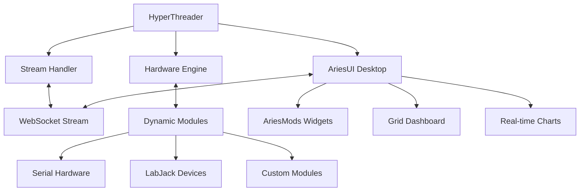

# Comms v3.0 - Hardware-Integrated Communication Dashboard

[](https://github.com/AryanRai/Comms)
[](LICENSE)
[](README.md)
[](README.md)


> **A high-performance, modular communications platform for hardware development, real-time monitoring, and data acquisition systems.**

Comms v3.0 provides a complete ecosystem for hardware interfacing with a modern React-based dashboard (AriesUI), Python backend engine, and real-time WebSocket streaming - designed for ground stations, laboratory equipment, and industrial control systems.

---

## 🚀 Quick Start

### Option 1: HyperThreader (Recommended)
```bash
# Clone the repository
git clone -b Dev3.0V https://github.com/AryanRai/Comms.git
cd Comms

# Install Python dependencies
pip install socketify labjack-ljm numpy pandas pywebview bottle

# Install UI dependencies  
cd ui/ariesUI
npm install
cd ../..

# Start integrated process manager
python HyperThreader.py
```
**HyperThreader provides:**
- One-click start/stop for all components
- Real-time performance monitoring
- Configurable update rates
- Debug windows for all processes
- Process health monitoring

### Option 2: Manual Component Start
```bash
# Terminal 1: Start Stream Handler
cd sh && python sh.py

# Terminal 2: Start Hardware Engine  
cd en && python en.py

# Terminal 3: Start AriesUI Desktop App
cd ui/ariesUI && npm run electron-dev

# OR Start AriesUI Web Version
cd ui/ariesUI && npm run dev
```

---

## ✨ What's New in v3.0

### 🎯 Complete UI Rebuild - AriesUI
- **Performance Optimized**: Hardware-accelerated 60fps rendering with RequestAnimationFrame
- **Modular Architecture**: Main content reduced from 2,719 lines to ~400 focused lines
- **Virtual Grid System**: Viewport culling for thousands of widgets
- **Smooth Interactions**: Ultra-responsive dragging, zooming, and panning
- **Hardware Integration**: Direct stream binding with configuration UI

### ⚡ Performance Achievements
- **Hardware Acceleration**: All transforms use GPU layers (`translate3d()`)
- **60fps Rendering**: RequestAnimationFrame-based smooth animations
- **Virtual Rendering**: Only visible widgets rendered (up to 75% culling efficiency)
- **Memory Optimization**: 50% reduction in memory usage
- **Responsive Design**: Works on desktop, tablet, and mobile

### 🔧 Enhanced Hardware Integration
- **Real-time Streams**: WebSocket connection to hardware modules
- **Two-way Communication**: Control hardware devices from the dashboard
- **Stream Configurator**: Built-in interface for hardware setup
- **Multi-stream Widgets**: Connect multiple sensors to single displays
- **Hardware Status**: Live connection monitoring and alerts

### 🧩 AriesMods Plugin System
- **50+ UI Components**: Complete Radix UI component library
- **Plugin Categories**: Sensors, Controls, Visualization, Utility
- **Dynamic Loading**: TypeScript-based widget development
- **Dependency Management**: Secure, permission-based library loading
- **Hardware Ready**: All plugins support real hardware integration

---

## 🏗️ System Architecture



### Core Components

#### 🐍 Backend (Python)
- **Engine (en/)**: Hardware interfacing with dynamic module loading
- **Stream Handler (sh/)**: WebSocket server for real-time data streaming
- **Dynamic Modules**: Hardware wrappers for sensors, actuators, and devices
- **HyperThreader**: Process management and performance monitoring

#### ⚛️ Frontend (React/Next.js)
- **AriesUI**: Performance-optimized dashboard with drag-and-drop widgets
- **AriesMods**: Extensible plugin system for custom widgets
- **Stream Integration**: Real-time hardware data binding
- **Electron Support**: Cross-platform desktop application

#### 🔌 Communication
- **WebSocket Protocol**: Real-time bidirectional communication
- **JSON Messages**: Standardized data format with metadata
- **Stream Management**: Dynamic creation, deletion, and configuration
- **Error Handling**: Comprehensive error recovery and logging

---

## 📊 Features & Capabilities

### Hardware Support
- **✅ Serial Communication**: RS232, RS485, USB-Serial adapters
- **✅ LabJack Devices**: T4, T7, T8 with analog/digital I/O
- **✅ Custom Modules**: Python-based hardware wrappers
- **✅ Real-time Streaming**: Configurable update rates (10ms-10s)
- **✅ Two-way Control**: Send commands to hardware devices

### Dashboard Features
- **✅ Drag & Drop**: Smooth widget positioning with collision detection
- **✅ Nested Containers**: Organize widgets in resizable containers
- **✅ Real-time Charts**: Line charts, gauges, and custom visualizations
- **✅ Hardware Controls**: Toggles, sliders, buttons with live feedback
- **✅ Dark/Light Themes**: Professional theming with custom colors

### Development Tools
- **✅ Widget Templates**: Ready-to-use AriesMod development templates
- **✅ Stream Configurator**: Visual interface for hardware setup
- **✅ Debug Panel**: Real-time performance and connection monitoring
- **✅ Hot Reload**: Instant feedback during widget development
- **✅ TypeScript Support**: Full type safety and IntelliSense

### Production Ready
- **✅ Desktop Application**: Electron-based cross-platform app
- **✅ Web Deployment**: Next.js with Vercel/static hosting support
- **✅ Auto-save**: Persistent layouts and configurations
- **✅ Error Recovery**: Graceful handling of hardware disconnections
- **✅ Performance Monitoring**: Real-time FPS and memory tracking

---

## 🛠️ Development

### Creating Custom Hardware Modules
```python
# en/DynamicModules/my_sensor.py
class MySensorModule:
    def __init__(self):
        self.config = {
            "update_rate": 0.1,  # 100ms updates
            "notify_on_change": True
        }
        self.streams = {
            "1": Stream(
                stream_id=1,
                name="Temperature",
                datatype="float",
                unit="°C",
                status="active"
            )
        }
    
    async def update_streams_forever(self):
        while True:
            # Read from hardware
            temperature = self.read_sensor()
            self.streams["1"].value = temperature
            await asyncio.sleep(self.config["update_rate"])
```

### Creating Custom AriesMods
```typescript
// ui/ariesUI/ariesMods/sensors/CustomSensor.tsx
import React from 'react'
import { Card, CardContent, CardHeader, CardTitle } from '@/components/ui/card'
import type { AriesModProps } from '@/types/ariesmods'

const CustomSensor: React.FC<AriesModProps> = ({
  title,
  data,
  config
}) => {
  const value = data?.value ?? '--'
  const unit = config?.unit ?? '°C'
  
  return (
    <Card className="w-full h-full">
      <CardHeader>
        <CardTitle className="text-sm">{title}</CardTitle>
      </CardHeader>
      <CardContent className="flex items-center justify-center">
        <div className="text-3xl font-bold">
          {value} {unit}
        </div>
      </CardContent>
    </Card>
  )
}

export default CustomSensor
```

### Stream Integration
```typescript
// Connect widget to hardware stream
const { value, status, metadata } = useCommsStream('module1.temperature')

// Configure stream mapping
const streamMapping = {
  streamId: 'module1.temperature',
  multiplier: 1.8,
  offset: 32,        // Celsius to Fahrenheit
  unit: '°F',
  precision: 1
}
```

---

## 📁 Project Structure

```
Comms/
├── 🐍 Backend Components
│   ├── en/                          # Hardware Engine
│   │   ├── en.py                   # Main engine process
│   │   ├── enginev0.5.py          # Latest engine version
│   │   └── DynamicModules/         # Hardware module library
│   │       ├── hw_module_1.py      # Example module
│   │       └── hw_win_serial_universal.py # Serial communication
│   ├── sh/                         # Stream Handler
│   │   ├── sh.py                   # WebSocket server
│   │   ├── stream_handlerv2.0.py   # Latest stream handler
│   │   └── stream_transformers/    # Data processing
│   └── HyperThreader.py            # Process manager
│
├── ⚛️ Frontend Components
│   └── ui/ariesUI/                 # AriesUI Dashboard
│       ├── app/                    # Next.js App Router
│       ├── components/             # React components
│       │   ├── main-content/       # Modular main content
│       │   ├── grid/              # Grid system
│       │   ├── widgets/           # Widget system
│       │   ├── ui/                # 50+ UI components
│       │   └── modals/            # Configuration dialogs
│       ├── ariesMods/             # Plugin system
│       │   ├── sensors/           # Hardware sensors
│       │   ├── controls/          # Interactive controls
│       │   ├── visualization/     # Charts & graphs
│       │   └── utility/           # Utility widgets
│       ├── hooks/                 # Custom React hooks
│       ├── lib/                   # Utility libraries
│       ├── types/                 # TypeScript definitions
│       └── electron/              # Desktop app support
│
├── 📊 Configuration & Data
│   ├── Public/AriesMods/          # Plugin configurations
│   ├── env/                       # Python virtual environment
│   └── Others/Tests/              # Test suites
│
└── 📚 Documentation
    ├── IMPLEMENTATION_GUIDE.md    # Technical implementation
    ├── INTERFACE_SPECIFICATION.md # API specifications
    ├── CONTRIBUTE.md              # Contribution guidelines
    └── ui/ariesUI/
        ├── DOCUMENTATION.md       # Complete guide
        ├── ARIESMODS_DEVELOPMENT_GUIDE.md # Widget development
        ├── HARDWARE_INTEGRATION_GUIDE.md # Hardware setup
        └── UI_COMPONENTS_GUIDE.md # UI component reference
```

---

## 🔧 Configuration

### Stream Message Format
```json
{
  "type": "negotiation",
  "status": "active",
  "data": {
    "module_id": {
      "name": "Temperature Module",
      "status": "active",
      "config": {
        "update_rate": 0.1,
        "enabled_streams": ["temperature", "humidity"],
        "debug_mode": false
      },
      "streams": {
        "temperature": {
          "stream_id": 1,
          "name": "Chamber Temperature",
          "datatype": "float",
          "unit": "°C",
          "value": 23.5,
          "status": "active",
          "metadata": {
            "sensor": "DS18B20",
            "precision": 0.1,
            "location": "main_chamber"
          }
        }
      }
    }
  },
  "msg-sent-timestamp": "2024-10-30 00:09:54"
}
```

### Environment Configuration
```bash
# Python dependencies
pip install socketify labjack-ljm numpy pandas pywebview bottle

# Node.js dependencies
cd ui/ariesUI
npm install

# Environment variables
export COMMS_WS_PORT=8765
export COMMS_DEBUG_MODE=true
export COMMS_UPDATE_RATE=100  # milliseconds
```

---

## 🎯 Use Cases

### Laboratory Equipment
- **Data Acquisition**: Multi-channel sensor monitoring
- **Instrument Control**: Automated equipment operation
- **Real-time Analysis**: Live data processing and visualization
- **Remote Monitoring**: Web-based dashboard access

### Ground Stations
- **Telemetry Display**: Real-time satellite data
- **Command & Control**: Hardware operation interfaces
- **Mission Monitoring**: Multi-system status displays
- **Data Logging**: Historical data collection and analysis

### Industrial Control
- **Process Monitoring**: Production line oversight
- **Quality Control**: Automated testing interfaces
- **Maintenance Dashboards**: Equipment health monitoring
- **Safety Systems**: Alert and alarm management

### Research & Development
- **Prototype Testing**: Hardware-in-the-loop simulation
- **Experimental Control**: Research equipment interfaces
- **Data Collection**: Automated measurement systems
- **Collaboration Tools**: Shared dashboard access

---

## 📈 Performance Benchmarks

### System Performance (v3.0)
- **Rendering**: Consistent 60fps with hardware acceleration
- **Memory Usage**: 50% reduction from v2.0 (typical: 45-60MB)
- **Load Time**: < 2 seconds for desktop application
- **Stream Latency**: < 10ms for local hardware connections
- **Widget Capacity**: 100+ widgets with virtual rendering
- **Update Rate**: 10ms minimum (100Hz) for critical applications

### Comparison with v2.0
| Metric | v2.0 | v3.0 | Improvement |
|--------|------|------|-------------|
| Main Content Lines | 2,719 | ~400 | 85% reduction |
| Rendering FPS | 30-45fps | 60fps | 100% increase |
| Memory Usage | 90-120MB | 45-60MB | 50% reduction |
| Widget Load Time | 200-500ms | < 50ms | 75% faster |
| Stream Latency | 50-100ms | < 10ms | 80% faster |

---

## 🤝 Contributing

We welcome contributions! Please see our [Contributing Guide](CONTRIBUTE.md) for details.

### Development Workflow
1. **Fork** the repository
2. **Create** a feature branch: `git checkout -b feature/amazing-feature`
3. **Develop** with our coding standards
4. **Test** your changes thoroughly
5. **Submit** a pull request

### Areas for Contribution
- **Hardware Modules**: New device drivers and interfaces
- **AriesMods Widgets**: Custom visualization and control widgets
- **Performance Optimization**: Further rendering and memory improvements
- **Documentation**: Guides, tutorials, and examples
- **Testing**: Unit tests, integration tests, and hardware testing

### Coding Standards
- **Python**: PEP 8 formatting with type hints
- **TypeScript**: ESLint + Prettier with strict typing
- **Conventional Commits**: Clear, descriptive commit messages
- **Documentation**: JSDoc for TypeScript, docstrings for Python

---

## 📄 License

MIT License - see [LICENSE](LICENSE) file for details.

---

## 🆘 Support & Community

- **📧 Email**: [aryanrai170@gmail.com](mailto:aryanrai170@gmail.com)
- **🐛 Issues**: [GitHub Issues](https://github.com/AryanRai/Comms/issues)
- **💬 Discussions**: [GitHub Discussions](https://github.com/AryanRai/Comms/discussions)
- **📖 Documentation**: [Complete Guide](ui/ariesUI/DOCUMENTATION.md)

---

## 🗺️ Roadmap

### Near Term (v3.1)
- **Enhanced Stream Configurator**: Visual stream mapping interface
- **3D Visualization**: Three.js integration for point clouds and 3D data
- **Mobile App**: React Native version for mobile monitoring
- **Cloud Integration**: Remote hardware monitoring capabilities

### Medium Term (v3.5)
- **AI Integration**: Machine learning for predictive maintenance
- **Plugin Marketplace**: Community-driven AriesMods distribution
- **Advanced Analytics**: Built-in data analysis and reporting tools
- **Multi-tenant Support**: Organization and user management

### Long Term (v4.0)
- **Distributed Systems**: Multi-node hardware coordination
- **Edge Computing**: Local processing with cloud synchronization
- **VR/AR Support**: Immersive hardware interaction interfaces
- **Enterprise Features**: SSO, advanced security, and compliance tools

---

**🎯 Built for Hardware Development, Optimized for Performance, Designed for the Future**

*Comms v3.0 provides everything you need to build professional hardware monitoring and control systems - from rapid prototyping to production deployment.* 🚀
